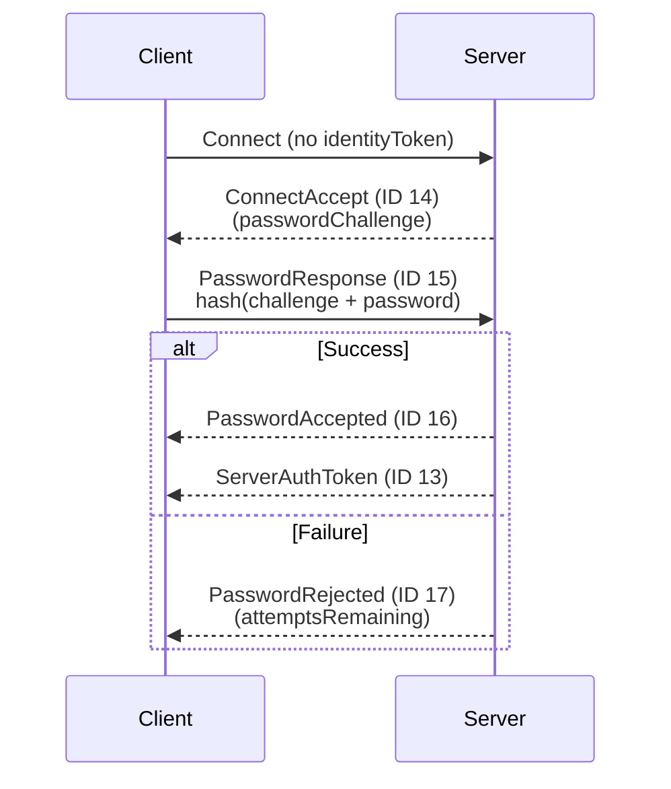

# Connection Packets & Flow

This section details the packets exchanged during the initial connection handshake and the state transitions required to enter the `PLAY` state.

## Connection State Machine

```cpp
enum class ConnectionState {
    CONNECTING,      // QUIC handshake in progress
    HANDSHAKING,     // Protocol handshake pending
    AUTHENTICATING,  // Waiting for auth tokens
    PLAY,            // Fully authenticated
    DISCONNECTING,   // Graceful disconnect
    DISCONNECTED     // Connection closed
};
```

## Complete Handshake Sequence

The following diagram illustrates the interaction between the Client, the AlloyServer, and Hytale Services.

```mermaid
sequenceDiagram
    participant C as Client
    participant S as AlloyServer
    participant API as Hytale Services

    C->>S: QUIC Handshake
    S-->>C: QUIC Connected

    Note over C,S: ID 0: Connect
    C->>S: Connect Packet<br/>(identityToken, uuid, username)
    
    rect rgb(30, 30, 35)
    Note right of S: Server verifies Client Identity
    S->>API: POST /server-join/auth-grant
    API-->>S: authorizationGrant
    end

    S-->>C: AuthGrant (ID 11)<br/>(serverIdentityToken)

    Note over C: Client exchanges grant<br/>via HTTP to Session Service

    C->>S: AuthToken (ID 12)<br/>(accessToken, serverAuthGrant)

    rect rgb(30, 30, 35)
    Note right of S: Server verifies Access Token
    S->>API: POST /server-join/auth-token<br/>(includes x509Fingerprint)
    API-->>S: accessToken
    end

    S-->>C: ServerAuthToken (ID 13)

    Note over C,S: Handshake Complete
    C->>S: ClientReady (ID 105)
    S-->>C: SetClientId (ID 100)
    S-->>C: JoinWorld (ID 104)
    S-->>C: WorldSettings (ID 20)
    
    C->>S: RequestAssets (ID 23)
    S-->>C: AssetInitialize (ID 24)
    S-->>C: AssetPart... (ID 25)
    S-->>C: AssetFinalize (ID 26)
    
    S-->>C: WorldLoadFinished (ID 22)
```



## Packet Definitions

### Connect (ID 0)

Initiates the protocol connection.

| Offset | Size | Field | Description |
| :--- | :--- | :--- | :--- |
| 0 | 1 | `nullBits` | Optional field flags |
| 1 | 64 | `protocolHash` | Protocol version (fixed ASCII) |
| 65 | 1 | `clientType` | Game or Editor |
| 66 | 16 | `uuid` | Player UUID |
| 82 | 4 | `languageOffset` | Offset to language string |
| 86 | 4 | `identityTokenOffset` | Offset to identity token |
| 90 | 4 | `usernameOffset` | Offset to username |

### AuthGrant (ID 11)

Sent by the server to provide the authorization grant.

**Fields:**
* `authorizationGrant`: String (max 4096)
* `serverIdentityToken`: String (max 8192)

### AuthToken (ID 12)

Sent by the client to finalize the token exchange.

**Fields:**
* `accessToken`: String (max 8192)
* `serverAuthorizationGrant`: String (max 4096)

## Password Authentication (Fallback)

If no identity token is provided in the `Connect` packet, the server falls back to password authentication.



## Certificate Handling

The server uses an ECDSA P-256 certificate.

* **Environment Variable**: `ALLOY_CERT_THUMBPRINT=<40-char hex SHA1>`
* **Fingerprint Usage**: The SHA-256 fingerprint (base64url) is sent in the `/server-join/auth-token` request to bind the session to the specific server instance.

:::warning QUIC Configuration
The server expects **ALPN: `hytale/1`** and an idle timeout of **60000ms**.
:::